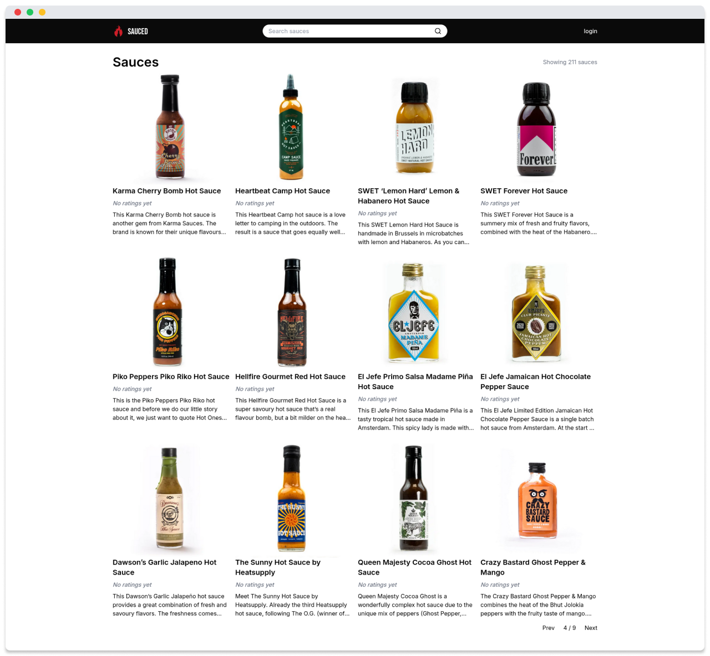

<p align="center">
  
</p>

<h1 align="center"><b>Sauced</b></h1>
<p align="center">A hot sauce rating app.</p>

<p align="center">
  
</p>

## Getting Started

Install dependencies:

```bash
pnpm i
```

Copy the `.env.example` files to `.env` and set the environment variables:

```bash
cp .env.example .env
```

## Development

Start the database using [Docker](https://www.docker.com/) with the following command:

```bash
pnpm docker:up
```

Run the scraper with the following command:
More information about scrapers can be found in the [scrapers README](./packages/scraper/README.md).

```bash
pnpm scrapers scrape <scraper-name>
```

Start the site with the following command:

```bash
pnpm site dev
```
